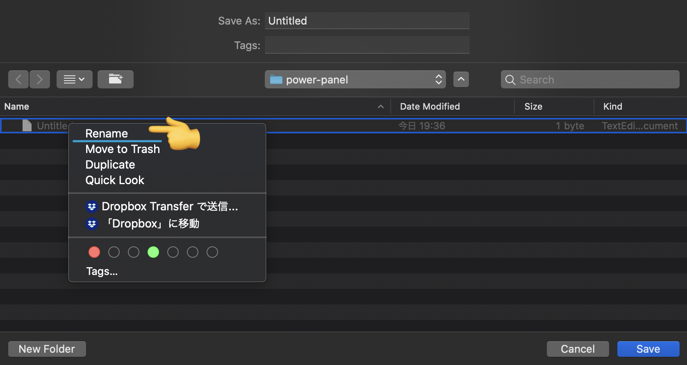
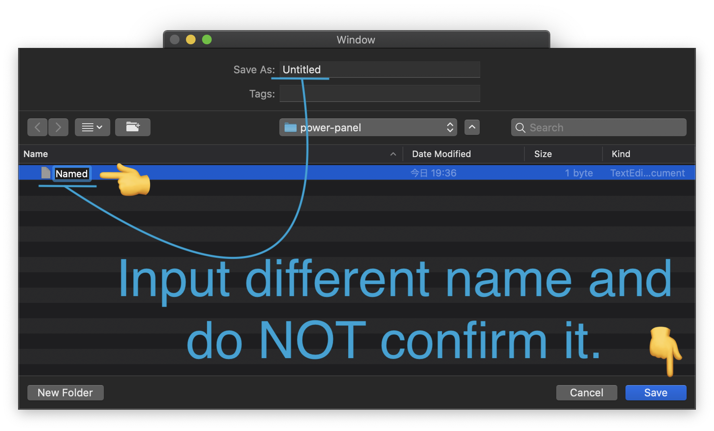
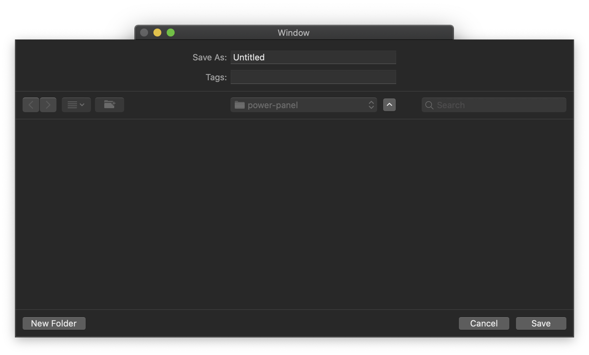

# feedback.apple.macOS-10.15.power-panel

10.15.4 Beta（19E242d）

## Steps to reproduce

1. Open Xcode project and 'Run'
2. Click 'Save' button
3. Change to some directory and select some file
4. Show context menu and select 'Rename' on selected file

5. Input different file name and do NOT confirm it and click 'Save'

- **Expected result**
  - Save panel closes and completion handler called
- **Actual result: Save panel closes**
  - Save panel does NOT closes and completion handler NOT called
  
